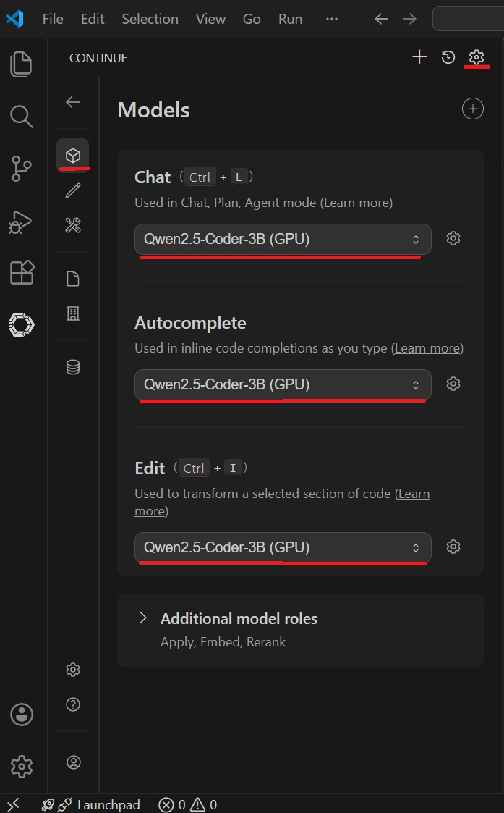
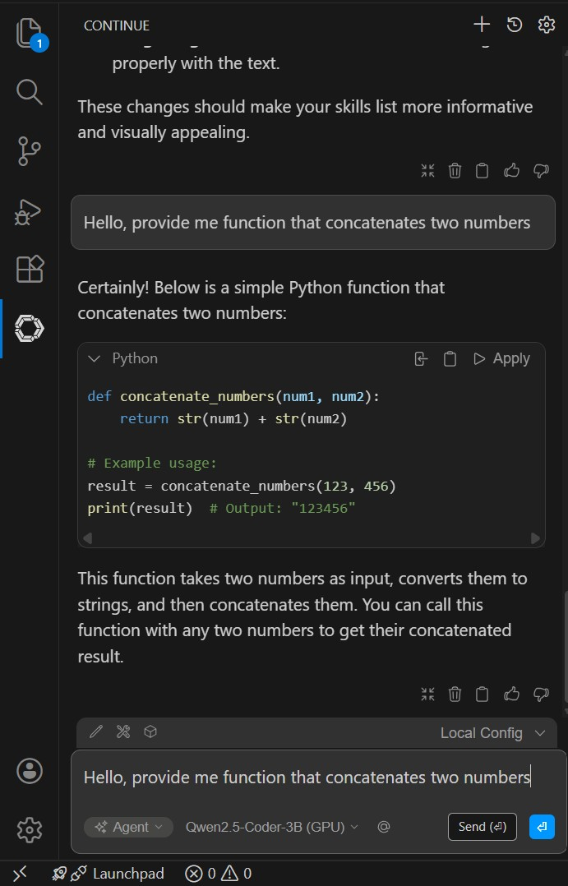

# OpenVINO Model Server for Continue VSCode Extension

Local AI models for code completion and chat in VS Code via [Continue Extension][continue]. This project can run various models, but the Qwen2.5-Coder model has shown good results experimentally. Server is precompiled for Windows.

## The hardware and software on which the system was run

- Laptop: Acer Swift Go 14 (iGPU Intel Arc, 18Gb GPU, 32Gb RAM)
- Software: Windows 11, [Intel® oneAPI Base Toolkit 2025.3.0][one-api], [Intel® Deep Learning Essentials 2025.3.0][deep-learning] (not sure that it's required)
- Folder: `C:\ai-projects\ovms-continue` (should work from any folder)

## Current models

| Model  | Size   | Speed    | Goal       |
|--------|--------|----------|------------|
| Qwen2.5-Coder-14B | ~8GB | ⚡ | Best quality |
| Qwen2.5-Coder-7B | ~4GB | ⚡⚡ | Balance |
| Qwen2.5-Coder-3B | ~2GB | ⚡⚡⚡ | Quick |
| Qwen2.5-Coder-1.5B | ~1GB | ⚡⚡⚡⚡ | Autocomplete |
| Qwen2.5-Coder-0.5B | ~300MB | ⚡⚡⚡⚡⚡ | Minimal resources |

## Quick start

### 1. Configure models

Edit `config_all.json` in `models` folder to configure models that should be loaded.

For example:

```json
{
    "model_config_list": [
        {
            "config": {
                "name": "Qwen2.5-Coder-0.5B-Instruct-int4-ov",
                "base_path": "Qwen2.5-Coder-0.5B-Instruct-int4-ov"
            }
        },
        {
            "config": {
                "name": "Qwen2.5-Coder-1.5B-Instruct-int4-ov",
                "base_path": "Qwen2.5-Coder-1.5B-Instruct-int4-ov"
            }
        },
        {
            "config": {
                "name": "Qwen2.5-Coder-3B-Instruct-int4-ov",
                "base_path": "Qwen2.5-Coder-3B-Instruct-int4-ov"
            }
        },
        {
            "config": {
                "name": "Qwen2.5-Coder-7B-Instruct-int4-ov",
                "base_path": "Qwen2.5-Coder-7B-Instruct-int4-ov"
            }
        }
        {
            "config": {
                "name": "Qwen2.5-Coder-14B-Instruct-int4-ov",
                "base_path": "Qwen2.5-Coder-14B-Instruct-int4-ov"
            }
        }
    ]
}
```

I not recommend to use many models. More models requires more memory.

### 2. Start OVMS

```cmd
cd C:\ai-projects\ovms-continue
start-ovms.bat
```

### 3. Check

Open in browser: http://localhost:8000/v3/models

### 4. Configure VS Code

[Continue][continue] will automatically connect to OVMS (port 8000).

Edit configuration file `C:\Users\<Username>\.continue\config.yaml` like so:

```yaml
models:
  - name: Qwen2.5-Coder-7B (GPU)
    provider: openai
    model: Qwen2.5-Coder-7B-Instruct-int4-ov
    apiKey: unused
    apiBase: http://localhost:8000/v3
    roles:
      - chat
      - edit
      - apply

  - name: Qwen2.5-Coder-1.5B (GPU)
    provider: openai
    model: Qwen2.5-Coder-1.5B-Instruct-int4-ov
    apiKey: unused
    apiBase: http://localhost:8000/v3
    roles:
      - autocomplete
```

Set your local models in Continue extension:



## Check that it's working



---
---

## Adding New Models from HuggingFace

### Download Model

```cmd
cd .\models
git clone https://huggingface.co/OpenVINO/Qwen2.5-Coder-7B-Instruct-int4-ov
```

### Prepare Model Structure

OVMS requires specific folder structure. After downloading:

**1. Create version subfolder `1/`:**

```cmd
cd Qwen2.5-Coder-7B-Instruct-int4-ov
mkdir 1
```

**2. Move model files into `1/`:**

```cmd
move *.json 1\
move *.bin 1\
move *.xml 1\
move *.txt 1\
move *.model 1\
```

**3. Create `graph.pbtxt`** in model root folder (not in `1/`):

```protobuf
input_stream: "HTTP_REQUEST_PAYLOAD:input"
output_stream: "HTTP_RESPONSE_PAYLOAD:output"

node: {
  name: "LLMExecutor"
  calculator: "HttpLLMCalculator"
  input_stream: "LOOPBACK:loopback"
  input_stream: "HTTP_REQUEST_PAYLOAD:input"
  input_side_packet: "LLM_NODE_RESOURCES:llm"
  output_stream: "LOOPBACK:loopback"
  output_stream: "HTTP_RESPONSE_PAYLOAD:output"
  input_stream_info: {
    tag_index: 'LOOPBACK:0',
    back_edge: true
  }
  node_options: {
      [type.googleapis.com / mediapipe.LLMCalculatorOptions]: {
          models_path: "./1",
          cache_size: 4,
          max_num_seqs: 256,
          dynamic_split_fuse: true,
          device: "GPU"
      }
  }
  input_stream_handler {
    input_stream_handler: "SyncSetInputStreamHandler",
    options {
      [mediapipe.SyncSetInputStreamHandlerOptions.ext] {
        sync_set {
          tag_index: "LOOPBACK:0"
        }
      }
    }
  }
}
```

Change `device: "GPU"` to `"CPU"` or `"NPU"` if needed.

**4. Create `chat_template.jinja`** for chat models (example for Qwen):

```jinja

    
        {{- '<|im_start|>system\n' + message['content'] + '<|im_end|>\n' -}}
    
        {{- '<|im_start|>user\n' + message['content'] + '<|im_end|>\n' -}}
    
        {{- '<|im_start|>assistant\n' + message['content'] + '<|im_end|>\n' -}}
    


    {{- '<|im_start|>assistant\n' -}}

```

### Final Model Structure

```
models/
└── Qwen2.5-Coder-7B-Instruct-int4-ov/
    ├── graph.pbtxt              # OVMS graph config
    ├── chat_template.jinja      # Chat format template
    └── 1/                       # Version folder (required!)
        ├── config.json
        ├── generation_config.json
        ├── openvino_model.xml
        ├── openvino_model.bin
        ├── openvino_tokenizer.xml
        ├── openvino_tokenizer.bin
        ├── openvino_detokenizer.xml
        ├── openvino_detokenizer.bin
        ├── tokenizer.json
        ├── tokenizer_config.json
        └── ...
```

### Add to config_all.json

```json
{
    "model_config_list": [
        {
            "config": {
                "name": "Qwen2.5-Coder-7B-Instruct-int4-ov",
                "base_path": "Qwen2.5-Coder-7B-Instruct-int4-ov"
            }
        }
    ]
}
```

### Important Notes

- **File encoding:** `graph.pbtxt` must be UTF-8 **without BOM**. PowerShell's `Out-File` adds BOM — use `[System.IO.File]::WriteAllText($path, $content, [System.Text.UTF8Encoding]::new($false))` instead.
- **Context length:** Models with small context (2K tokens like GPT-J) don't work well with Continue. Use models with 4K+ context.
- **Vision models:** May require newer OpenVINO version.

## Links

- [OpenVINO Model Server](https://docs.openvino.ai/2025/model-server/ovms_what_is_openvino_model_server.html)
- [Continue Documentation](https://docs.continue.dev/)
- [OpenVINO models](https://huggingface.co/OpenVINO)

## Authors

This project was created for fun by [Oleksandr Lopatnov](https://www.linkedin.com/in/lopatnov/). 

[continue]: https://marketplace.visualstudio.com/items?itemName=Continue.continue
[one-api]: https://www.intel.com/content/www/us/en/developer/tools/oneapi/base-toolkit-download.html
[deep-learning]: https://www.intel.com/content/www/us/en/developer/tools/oneapi/base-toolkit-download.html?packages=dl-essentials&dl-essentials-os=linux&dl-lin=offline